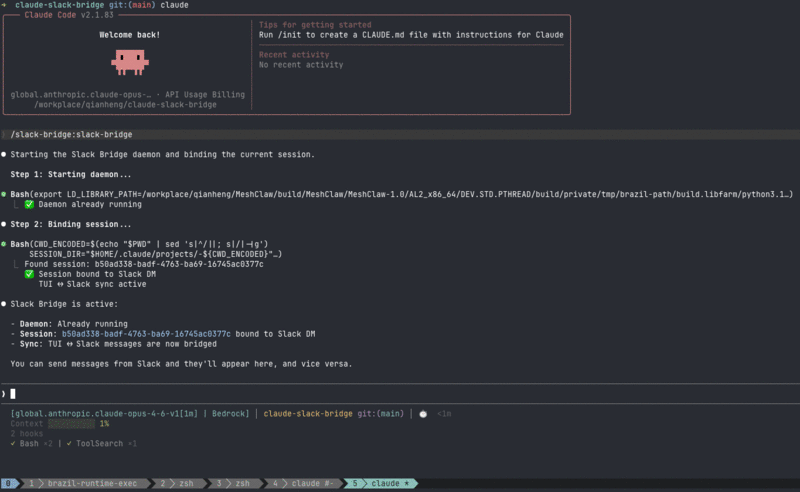

# Claude Slack Bridge

[](https://opensource.org/licenses/MIT)
[](https://www.python.org/downloads/)
[](https://api.slack.com/apis/socket-mode)
[](https://docs.anthropic.com/en/docs/claude-code)

Bridge Claude Code sessions to Slack — chat with Claude from your phone via Slack threads.

English | [中文](README.zh.md)

<p align="center">
  
</p>

## How it works

A daemon runs in the background, connecting Claude Code to Slack via Socket Mode:

```
Slack Thread ←→ Daemon ←→ claude --print (stdin/stdout)
       ↑                         ↑
       └── TUI hooks sync ───────┘
```

**Dual-mode architecture:**
- **PROCESS mode** — Slack drives Claude via `--print` subprocess
- **TUI sync** — hooks sync TUI prompts & responses to Slack thread
- **IDLE mode** — session paused, either side can resume

TUI and Slack can operate on the same session simultaneously — Slack uses `--resume --print` alongside the running TUI.

## Features

- **@mention or DM** to start a session — thread replies continue the conversation
- **TUI ↔ Slack sync** — prompts and responses sync to a Slack thread via hooks
- **Session binding** — `/slack-bridge` command auto-binds TUI session to Slack DM
- **Streaming responses** — live preview updates, final result overwrites progress
- **OPTIONS buttons** — clickable suggestion buttons in Slack
- **Markdown → mrkdwn** — proper formatting, long messages auto-split

## How is this different?

### vs Claude Slack App (official)

The official Claude Slack app is a standalone chatbot that calls the Claude API. This project bridges your **local Claude Code session** to Slack — with full access to your filesystem, tools, and codebase.

### vs Remote Control (official)

[Remote Control](https://code.claude.com/docs/en/remote-control) connects claude.ai/code or the Claude mobile app to a local session. It's similar in concept but differs in key ways:

| | Remote Control | Claude Slack Bridge |
|---|---|---|
| **Client** | claude.ai/code or Claude app (full UI) | Slack (message-based) |
| **Auth** | Requires claude.ai Pro/Max/Team/Enterprise — no API key or Bedrock | Works with any Claude Code setup including Bedrock/API keys |
| **Team visibility** | Private session | Shared in Slack channels — team can follow along |
| **Integration** | Standalone interface | Fits into existing Slack workflows (search, notifications, @mentions) |

If you have a claude.ai subscription, Remote Control gives a richer UI. This project is better for **Bedrock/API key users**, **team visibility**, or when you want Claude Code woven into your Slack workflow.

## Install

### As Claude Code Plugin (recommended)

```bash
# Clone
git clone https://github.com/qianheng-aws/claude-slack-bridge.git
cd claude-slack-bridge
python3 -m venv .venv
.venv/bin/pip install -e .

# Register as Claude Code marketplace
claude plugins marketplace add /path/to/claude-slack-bridge
claude plugins install slack-bridge@qianheng-plugins

# Initialize config
.venv/bin/claude-slack-bridge init
# Edit ~/.claude/slack-bridge/.env with your Slack tokens
```

Then in Claude Code TUI:
```
/slack-bridge    → start daemon + bind session to Slack DM
```

### Manual Setup

```bash
git clone https://github.com/qianheng-aws/claude-slack-bridge.git
cd claude-slack-bridge
python3 -m venv .venv
.venv/bin/pip install -e .

# Initialize config
.venv/bin/claude-slack-bridge init

# Edit ~/.claude/slack-bridge/.env:
#   SLACK_BOT_TOKEN=xoxb-...
#   SLACK_APP_TOKEN=xapp-...
```

### Slack App Setup

1. Create app at https://api.slack.com/apps
2. Enable **Socket Mode** (generates `xapp-` token)
3. Add **Bot Token Scopes**: `app_mentions:read`, `channels:history`, `channels:read`, `chat:write`, `im:history`, `im:read`, `reactions:write`
4. **Event Subscriptions** → Subscribe to bot events: `app_mention`, `message.channels`, `message.im`
5. **Interactivity** → Enable (for OPTIONS buttons)
6. Install app to workspace, invite bot to channels

## Usage

### Plugin Commands

| Command | Effect |
|---------|--------|
| `/slack-bridge` | Start daemon + bind current session to Slack DM |
| `/slack-bridge-stop` | Stop daemon |
| `/slack-bridge-status` | Show status and active sessions |
| `/slack-bridge-logs` | View recent daemon logs |

### Slack Commands

| Command | Where | Effect |
|---------|-------|--------|
| `@bot <prompt>` | Channel | New session |
| `<message>` | DM | New session |
| Reply in thread | Thread | Continue session |
| `@bot resume <UUID>` | Channel | Bind TUI session to thread |
| `resume <UUID>` | DM | Bind TUI session to thread |
| `yolo off` | Thread | Disable auto-approve |

### Makefile Shortcuts

```bash
make install   # setup venv and install
make test      # run tests
make start     # start daemon
make stop      # stop daemon
make status    # health check + sessions
make logs      # tail daemon log
```

### TUI ↔ Slack Workflow

```
1. Start TUI:     claude
2. Bind to Slack:  /slack-bridge
3. Chat in TUI  →  prompts & responses sync to Slack thread
4. Reply in Slack → Claude responds in Slack (same session context)
5. Exit TUI      →  continue from Slack, or resume later
```

## Config

`~/.claude/slack-bridge/config.json` (see `config.json.example`):

```json
{
  "daemon_port": 7778,
  "work_dir": "/path/to/default/cwd",
  "claude_args": ["--tools", "Bash,Read,Write,Edit,Glob,Grep"],
  "require_approval": false,
  "auto_approve_tools": ["Read", "Glob", "Grep"],
  "approval_timeout_secs": 300,
  "max_concurrent_sessions": 3,
  "session_archive_after_secs": 3600
}
```

## Architecture

See [ARCHITECTURE.en.md](ARCHITECTURE.en.md) | [ARCHITECTURE.md (中文)](ARCHITECTURE.md) for the full dual-mode state machine design.

## Tests

```bash
make test
# or
.venv/bin/pytest tests/ -q
```

## License

[MIT](LICENSE)
